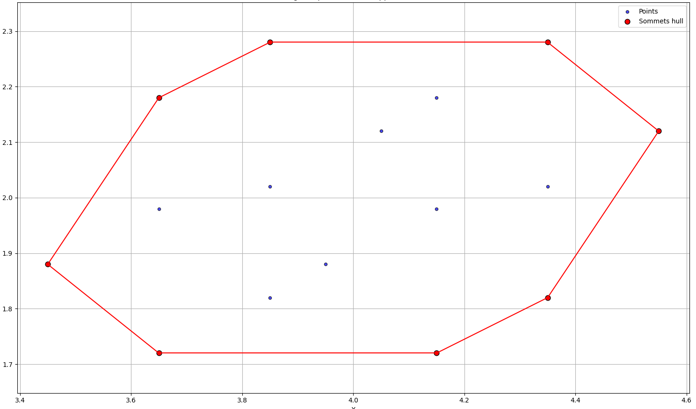

# DYNIbex FastAF(fine) — Quick Computation of Zonotope from Dynibex

This program illustrates a method to:

- manipulate **uncertain affine representations** with [**DynIbex**](https://perso.ensta-paris.fr/~chapoutot/dynibex/),  
- generate the **candidate vertices** of a **zonotope**,  
- compute its **convex hull** using [**Qhull**](http://www.qhull.org/),  
- extract and display the **vertices of the convex hull**.  

It was developed as part of research at **ENSTA Paris**  
(STARTS Project - CIEDS - Institut Polytechnique).

---
****************
Image: Zonotope computed from an affine form.
<p align="center">
  
</p>

****************

## Dependencies
To compile and run this program, you need:

- [Ibex/DynIbex](https://perso.ensta-paris.fr/~chapoutot/dynibex/)  
  **⚠️ Use the sources (`/dynibex-XX/src`) from my repo!**  
- [Qhull](http://www.qhull.org/)

### Install Qhull (Ubuntu/Debian)
```bash
sudo apt-get install qhull-bin libqhull-dev
````

---

## Compilation

The project is compiled using a **Makefile**.

Compile:

```bash
make
```

Run:

```bash
./simulation.out
```

---

## Example Run

Console output:

```
AffineDecomp vector (2 elements):
  [0] 4 + 0.1*eps_1 + 0.1*eps_2 + 0.1*eps_3 + 0.25*eps_4 + [-0, 0]
  [1] 2 - 0.08*eps_1 + 0.15*eps_2 + 0.05*eps_3 + [-0, 0]
Known generator : eps_1 ; eps_2 ; eps_3 ; eps_4 ; 
Convex hull vertices:
3.65 2.18
4.35 2.28
3.85 2.28
3.65 1.72
3.45 1.88
4.35 1.82
4.55 2.12
4.15 1.72
```

---

## Code Structure
---

## Affine Arithmetic

Uncertain quantities are represented as:

```
x = x0 + x1·ε1 + x2·ε2 + ... + xn·εn   ,   εi ∈ [-1, 1]
```

Here:

* `x0` = central (nominal) value
* `xi` = deviation coefficients
* `εi` = noise symbols (shared across computations)

---

### 0. Affine Representation (`AffineDecomp`)

* `center`: central value,
* `coeffs`: coefficients associated with noise variables `eps_i`,
* `garbage`: interval representing the error.

Utilities:

* `make_affine`: creates a DynIbex affine form from the custom format,
* `decompose_affine`: converts from DynIbex to the internal format,
* `DyniAff2Vec`: converts a DynIbex affine vector into a `vector<AffineDecomp>`.

---

### 1. Full Pipeline

* `Affine2Vertices`:
Compute the vertices from a Faffulli affine form from DynIbex
  1. generates candidate vertices with `candidate_vertices`,
  2. applies Qhull to compute the convex hull.

---

### 2. Candidate Vertex Generation

* `build_generators`: constructs the zonotope generators,
* `generate_sign_combinations`: enumerates all possible sign combinations,
* `candidate_vertices`: computes the candidate vertices (center + combinations).

---

### 3. Convex Hull with Qhull

* `computeConvexHullVertices`: takes a `std::vector<std::vector<double>>`
  and returns the convex hull vertices.

---

### 4. Main Example (`main`)

* Defines two affine variables (`x1`, `x2`),
* Builds an affine vector (`yinit_aff`),
* Computes the zonotope vertices with `Affine2Vertices`,
* Prints the result.

A **differential simulation (Van der Pol)** is provided in comments to illustrate integration with DynIbex.

---

## 📖 License

This program is distributed under the **GNU LGPL** license.

